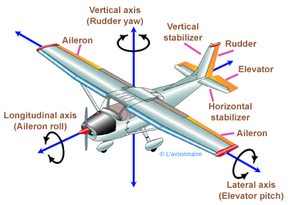
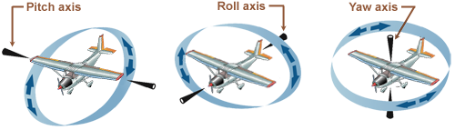
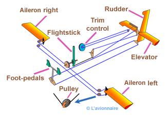
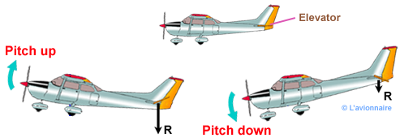
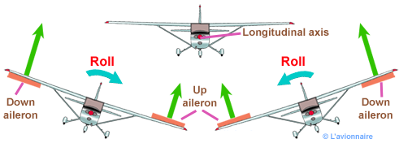
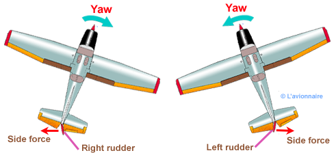

<h2>FLIGHT CONTROLS </h2>	
 	
<h3>Primary Flight Controls</h3>

The primary controls are the ailerons, elevator, and the rudder, which provide the aerodynamic force to make the aircraft follow a desired flightpath.   

 

<!-- /figure -->	

 

<!-- /figure -->

 

<!-- /figure -->
<h4>Elevator</h4>

 When the pilot moves the controls forward, the elevator surface is deflected downwards. This increases the camber of the horizontal stabilizer resulting in an increase in lift. The additional lift on the tail surface causes rotation around the lateral axis of the aircraft and results in a nose down change in aircraft attitude. The opposite occurs with an aft movement of the flight deck controls.   

 

<!-- /figure  -->	
<h4>Aileron</h4>

Ailerons control roll about the longitudinal axis. The ailerons are attached to the outboard trailing edge of each wing and move in the opposite direction from each other. Ailerons are connected by cables, bellcranks, pulleys, and/or tubes a  control stick. 

 

<!-- /figure  -->
<h4>Rudder</h4>

The increase in camber of the  wing results in an increase in lift but this, in turn, also causes an increase in drag. This added drag causes the wing to slow down slightly resulting in rotation, referred to as yaw,around the vertical axis. To overcome this yaw rudder input is required while entering and exiting a turn. To minimise the amount of adverse yaw produced during a turn.
 

 

<!-- /figure  -->

   

